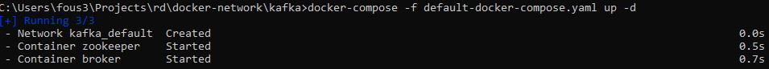
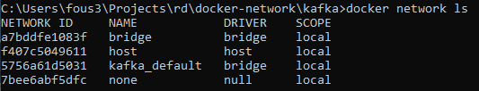
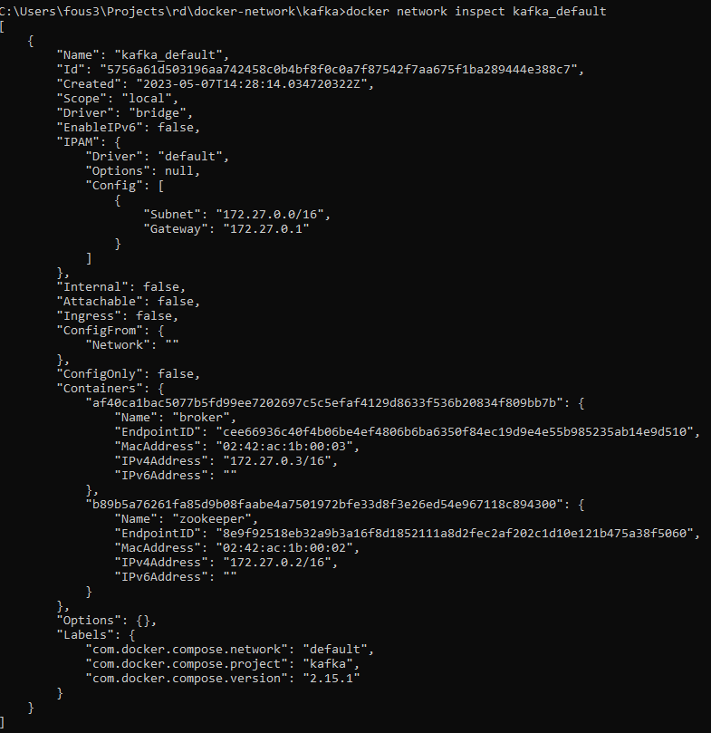
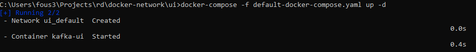
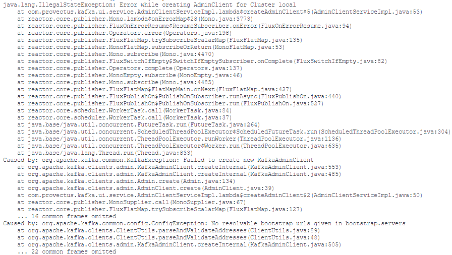
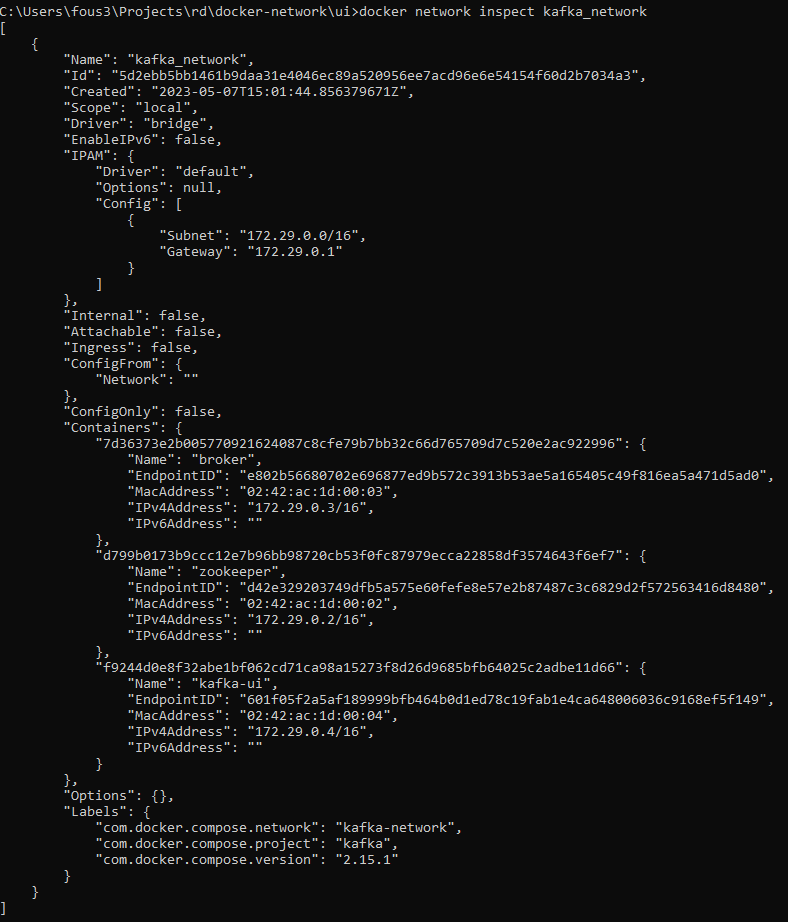
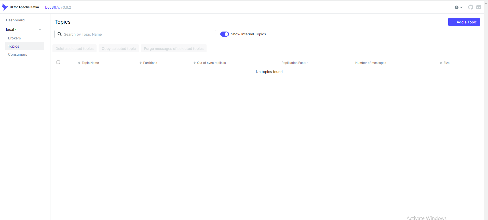

# Объяснение насчет подключения докер контейнеров из разных docker-compose файлов

## Проблема:
Есть два разных docker-compose файла со своими контейнерами и требуется, чтобы контейнер из одного docker-compse файла был доступен для других контейнером из другого docker-compose файла.

## Источник проблемы:
Причина почему данная проблема появилась заключается в том, что когда создаются контейнеры из под docker-compose, то создается отдельная сеть в docker из-за чего контейнеры из другой сети не могут получить доступ к тем контейнерам. Источник: https://docs.docker.com/compose/networking/

## Пример:
Данны два docker-compose файла в разных директориях. Первый kafka, в котором запускается kafka broker и zookeeper. Второй ui, на котором запускатся отдельное приложение Kafka UI, которая будем подключаться к kafka broker по адресу "broker:9092", которая работет, если приложение находилось бы внутри docker-compose файла, где находится kafka broker и zookeeper.

Для запуска будут использованы файлы с префиксом "default-*", которые были сделаны по принципу copy-paste.

Сначала запустим docker-compose из под директории kafka.



Как можно увидеть, создаются контейнеры broker и zookeeper, но также можно увидеть "Network kafka_default". Данная строка означается, что создалась docker сеть с именем kafka_default. NOTE: Данное сообщение можно увидеть только при первом запуске docker-compose, так как все последующие запуски будут использовать эту же сеть.

Данную сеть можно увидеть через команду "docker network ls".



Так же можно проверить какие контейнеры к ней подключены через команду "docker network inspect kafka_default". NOTE: Стоит запомнить команду "docker network inspect", так как она будет использована далее по объяснению.



После создаем Kafka UI из под директории ui.



Как можно увидеть, создаются контейнеры kafka-ui, но также можно увидеть "Network ui_default", что означает, что создалась отдельная сеть и внутри контейнера kafka-ui можно увидеть лог об ошибке.



Который говорит, что не может быть найдет url не может быть обработан. Так произошло, потому что broker не находится в сети ui_default и kafka-ui не находится в сети kafka_default.

## Решение

Что бы решить данную ситуацию нужно добавить один из контейнеров в нужную сеть.
В ситуации из примера необходимо будет добавить broker в сеть ui_default или kafka-ui в сеть kafka_default.
Что бы это сделать нужно воспользоваться командой "docker network connect" (https://docs.docker.com/engine/reference/commandline/network_connect/).

Пример использования: docker network connect kafka_default kafka-ui.

После использования необходимо будет перезапустить сам контейнер.

Однако данный подход не совсем удобный для случая из примера, так как две сети являются излишными и хватает только одной. Что бы подключить контейнера из разных docker-compose файлов в одну, необходимо будет создать одну общую сеть.
Что бы создать данную можно воспользоваться командой "docker network create" (https://docs.docker.com/engine/reference/commandline/network_create/), которая создаст сеть на подобии сетей из примера kafka_default и ui_default.

Пример использования: docker network create kafka_network.

Либо создать через docker-compose. Пример есть в файле kafka/docker-compose.yaml. Создается через блок:

```yaml
networks:
  kafka-network:
    driver: bridge
    name: kafka_network
```

Который создаст сеть с именем kafka_network. (https://docs.docker.com/compose/compose-file/06-networks/)

Далле необходимо добавить в docker-compose файлы следующий кусок:

```yaml
networks:
  kafka-network:
    name: kafka_network
    external: true
```

Который можно увидеть в ui/docker-compose.yaml. Данный кусок обозначает, что будет использована внешняя сеть kafka_network. (https://docs.docker.com/compose/compose-file/06-networks/)

Так же необходимо добавить использование нужной сети в нужные контейнеры. Пример есть в ui/docker-compose. 

Блок кода:

```yaml
services:
  kafka-ui:
    ...
    networks:
      - kafka-network
```

После добавление использование сети kafka_network в контейнеры kafka-ui, zookeeper и broker. При запуске будет создана сеть, если она уже не была создана, и создадутся или запустятся контейнеры.

При проверки через "docker network inspect" можно будет увидеть, что подключены все три контейнера.



И в логах kafka-ui не появляется ошибки. Так же при входе на kafka-ui, можно будет увидеть информацию по подключенному брокеру.

